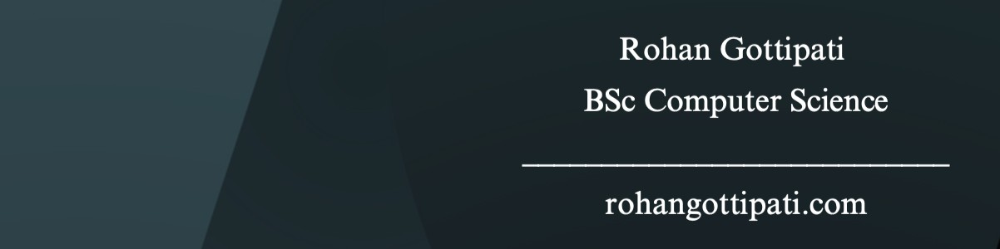

<p align="center">
  
</p>

## About Me

```typescript
const rohan = {
  name: "Rohan Gottipati",
  university: "Wilfrid Laurier University",
  major: "Computer Science, Big Data Concentration",
  focus: "AI/ML & Full Stack Development",
  passions: ["Software Integrations", "Big Data", "Building MVPs"],
  techStack: {
    languages: ["Python", "Java", "R", "C", "SQL", "TypeScript", "JavaScript", "HTML", "CSS"],
    frameworksAndLibraries: ["React", "Next.js", "FastAPI", "pandas", "NumPy", "scikit-learn", "ggplot2", "Tailwind CSS"],
    toolsAndTechnologies: ["REST APIs", "Node.js", "PostgreSQL", "Firebase", "Supabase", "Gemini API", "Docker", "Git", "Vercel"],
  },
  currentFocus: "Software Development, Backend systems, AI integration",
  learning: "Emotion-inspired AI Research, Data Analysis, AI & Machine Learning",
};
```

<p align="center">
  <picture>
    <source media="(prefers-color-scheme: dark)" srcset="https://raw.githubusercontent.com/RohanGottipati/RohanGottipati/refs/heads/output/github-contribution-grid-snake-dark.svg" />
    <source media="(prefers-color-scheme: light)" srcset="https://raw.githubusercontent.com/RohanGottipati/RohanGottipati/refs/heads/output/github-contribution-grid-snake.svg" />
    
  </picture>
</p>

## All My Socials

<p align="left">
  <a target="_blank" href="mailto:rohan.gottipati@gmail.com"></a>&nbsp;
  <a target="_blank" href="https://www.linkedin.com/in/rohangottipati/"></a>&nbsp;
  <a target="_blank" href="https://devpost.com/rohan-gottipati"></a>&nbsp;
  <a target="_blank" href="https://www.rohangottipati.com"></a>
</p>
